# Optional Project: Fixed-Wing Control

## Table of Contents

- [Preface](#preface)
  * [Fixed Wing Equations](#fixed-wing-equations)
- [Longitudinal Scenarios](#longitudinal-scenarios)
  * [Scenario #1: Trim](#scenario-1-trim-unity-only)
  * [Scenario #2: Altitude Hold](#scenario-2-altitude-hold)
  * [Scenario #3: Airspeed Hold](#scenario-3-airspeed-hold)
  * [Scenario #4: Steady Climb](#scenario-4-steady-climb)
  * [Scenario #5: Longitudinal Challenge](#scenario-5-longitudinal-challenge)
- [Lateral / Directional Scenarios](#lateral--directional-scenarios)
  * [Scenario #6: Stabilized Roll Angle](#scenario-6-stabilized-roll-angle)
  * [Scenario #7: Coordinated Turn](#scenario-7-coordinated-turn)
  * [Scenario #8: Constant Course/Yaw Hold](#scenario-8-constant-courseyaw-hold)
  * [Scenario #9: Straight Line Following](#scenario-9-straight-line-following)
  * [Scenario #10: Orbit Following](#scenario-10-orbit-following)
  * [Scenario #11: Lateral/Directional Challenge](#scenario-11-lateraldirectional-challenge)
- [Final Challenges](#final-challenges)
  * [Scenario #12: Full 3D Challenge](#scenario-12-full-3d-challenge)
  * [Scenario #13: Flying Car Challenge](#scenario-13-flying-car-challenge)
  
---

## Preface

This file contains my solution writeup for the [Udacity Flying Car Nanodegree Fixed Wing Project](https://github.com/udacity/FCND-FixedWing).  It's structured as the original README, with a section for the implementation details of each scenario.

### Fixed Wing Equations
* The original cheatsheet with equations for this project is [available online](https://www.overleaf.com/read/cvqmtzyhqjnj).
* A [rendered PDF](Fixed%20Wing%20Cheatsheet.pdf) has been included in this repository.

---

## Longitudinal Scenarios

### Scenario #1: Trim (Unity Only)

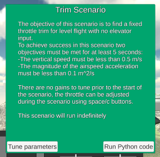

This scenario requires no coding or gains to tune -- just calibrating the values manually on the flight simulator.

The fixed throttle at **65.8%** eventually leads to success:

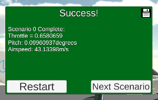

### Scenario #2: Altitude Hold

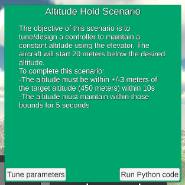


This scenario requires implementing the pitch hold and altitude hold controllers.  They are implemented as PD and PI controllers, respectively.


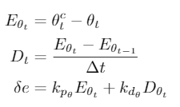

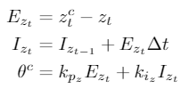

Tuning the process produces the following gains:

```
    # Gain parameters for pitch_loop PD controller
    self.kp_pitch = 4.0
    self.kp_q = 0.5

    # Gain parameters for altitude_loop PI controller
    self.kp_alt = 0.03
    self.ki_alt = 0.02
```

Of note, the official solution (and the tuning facility through Unity!) has a couple of implementation choices that cause a discrepancy between the tuning obtained in Unity and the initial implementation I had:
- A minimum pitch command is set to -10 degrees, different from the maximum pitch command of 30 degrees.
- A particular implementation of integrator anti-windup is used on the PI controller for attitude_loop:

```
    # Integrator anti-windup
    if(gain_i_alt != 0):
        self.alt_int = self.alt_int + dt/gain_i_alt*(pitch_cmd-pitch_cmd_unsat)
``` 
 
This implementation changes the integrated error to have been updated by a value equivalent to the error that would have been added if the commanded pitch had been its saturated value, rather than the unbounded one.

I implemented equivalent logic, for ease of tuning in future scenarios.

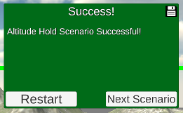

### Scenario #3: Airspeed Hold

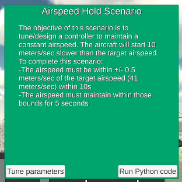

This scenario requires implementing a PI controller for the airspeed hold based on throttle. 


The code implementation is *almost* analogous to the implementation for the PI controller on the altitude loop -- we include a feed-forward term based on the throttle obtained for scenario 1.

Initial tuning provides the following gain values:

```
    # Gain parameters for airspeed_loop PI controller
    self.kp_speed = 0.4
    self.ki_speed = 0.3

    # Feed-forward term for throttle
    self.throttle_feedforward = 0.658
```

This works! ... after making sure that the code was running on a sufficiently fast computer, with the relevant graphic options set (i.e. disabling G-SYNC on my NVIDEA GTX card.)

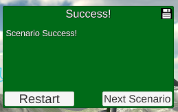

### Scenario #4: Steady Climb

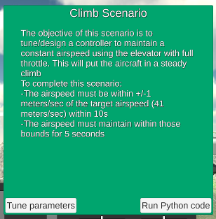

This requires yet another PI controller -- this time, for the climb state; controlling the airspeed hold based on pitch.


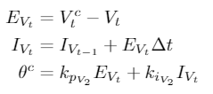

The Unity / manual tuning of parameters seems to not work at all for this scenario -- tuning had to be done by running the python script and changing its parameters there instead.

```
    # Gain parameters for airspeed_pitch_loop PI controller
    self.kp_speed_pitch = -0.2
    self.ki_speed_pitch = -0.2
```

These parameters are *negative*, unlike all of the gains seen so far -- the commanded pitch here is expected to be negative when climbing.

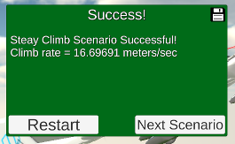

### Scenario #5: Longitudinal Challenge

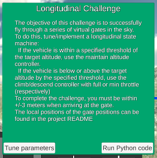

This is relatively straightforward -- there are three potential states:

* If the altitude is too low, climb -- set throttle to max, and use airspeed_pitch_loop to control the pitch
* If the altitude is too high, 'climb down' -- set throttle to min, and use airspeed_pitch_loop to control the pitch
* Otherwise, control the throttle with airspeed_loop and the pitch with pitch_loop

Testing produced catastrophic crashes at threshold of 50m, the plane was not able to stay within the 'good enough' band with a threshold of 10m, and a threshold of 20m proved sufficient:

```
    # Threshold for switching behavior on altitude matching
    self.altitude_switch = 20
```


---

## Lateral / Directional Scenarios

### Scenario #6: Stabilized Roll Angle

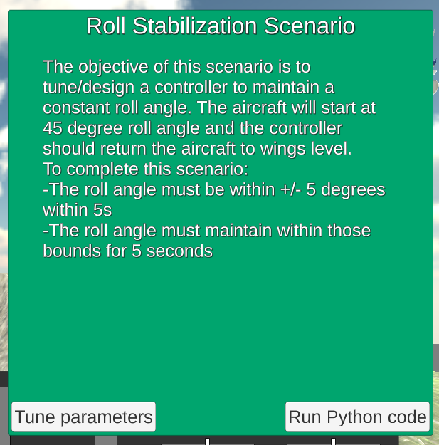

One more PD controller; the intended roll speed is always 0.


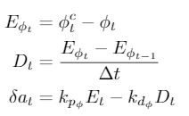

Tuning allows for a controller with gains as aggressive as Kp = 10, Ki = 1; these parameters work with the partially implemented script as well.
```
    # Gain parameters for roll_attitude_hold_loop PD controller
    self.kp_roll = 10.0
    self.kd_roll = 1.0
```

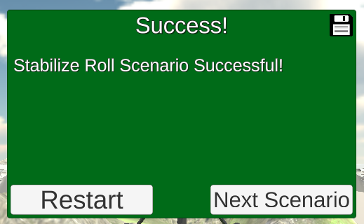

### Scenario #7: Coordinated Turn

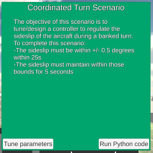

This scenario calls for a PI controller on beta -- the sideslip value, which should be controlled back to zero.


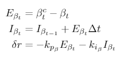

Initial tuning provided the following gains:

```
    # Gain parameters for the sideslip_hold_loop PI controller
    self.kp_sideslip = -2.0
    self.ki_sideslip = -1.0
```

As suggested on the scenario, however, there is occasional instability, potentially caused by difference in integration steps.  This is remediated by implenting [trapezoidal integration](https://en.wikipedia.org/wiki/Trapezoidal_rule):

```
    def sideslip_hold_loop(self,
                           beta, # sideslip angle
                           T_s):
        # Implemented as a PI controller; sideslip should be commanded to zero

        beta_error = -beta

        # Implementing trapeizodal integration
        self.integrator_beta += (beta_error + self.beta_error_last) * T_s / 2
        self.beta_error_last = beta_error

        rudder_unbound = self.kp_sideslip * beta_error + self.ki_sideslip * beta_error

        if rudder_unbound > 1:
            rudder = 1
        elif rudder_unbound < -1:
            rudder = -1
        else:
            rudder = rudder_unbound

        # Integrator anti-windup
        if self.ki_sideslip != 0 and rudder != rudder_unbound:
            self.integrator_beta += T_s / self.ki_sideslip * (rudder - rudder_unbound)

        return rudder
```

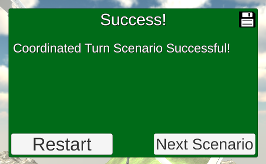

### Scenario #8: Constant Course/Yaw Hold

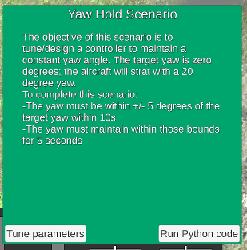

This scenario calls for a PI controller for the yaw.


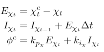

Note: The documentation for the `yaw_hold_loop` method initially referred to parameter roll_rate, which does not exist, and does not include documentation for the feed forward parameter, which does exist.  The documentation has been updated on the solution.

Extra care being taken to keep the yaw within the -pi to pi range -- all angles (but not angular velocities) are converted to values between -pi and pi on this implementation, with the help of the function defined below as a static method in `LateralAutoPilot`. 

```
    """Used to limit angles to values between -pi and pi
    
       Args:
           theta: angle to limit between -pi and pi
           
       Returns:
           value between -pi and pi
    """
    @staticmethod
    def fmod(theta):
        return theta if abs(theta) < np.pi else (theta + np.pi) % (2 * np.pi) - np.pi
```

Tuning using Unity also failed to work for this scenario -- the behavior seems unresponsive to the UI parameters.  Tuning was instead performed using my own implementation.

```
    # Gain parameters for the yaw_hold_loop PI controller
    self.kp_yaw = 2.1
    self.ki_yaw = 0.4
```

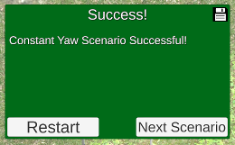

### Scenario #9: Straight Line Following

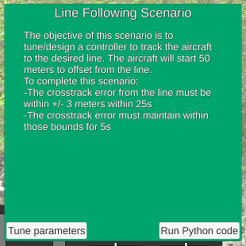

This scenario asks us to implement `straight_line_guidance`.

* Given the plane's position and target position on the line, we can compute the current orientation
* Given the line heading, we can compute the angle between it and the plane orientation, which should be controlled down to zero.

```
    def straight_line_guidance(self, line_origin, line_course,
                               local_position):
        # Compute the N, E orientation components on the inertial frame
        orientation_n = line_origin[0] - local_position[0]
        orientation_e = line_origin[1] - local_position[1]

        # Compute the orientation angle and error on the inertial frame
        orientation_angle = np.arctan2(orientation_e, orientation_n)
        orientation_error = line_course - orientation_angle

        # Control the error to zero
        course_cmd = self.kp_course * orientation_error + line_course

        return course_cmd
```

The initial guess for a tuning parameter worked well enough, once I adjusted its sign:

```
    # Gain parameters for the straight_line_guidance P controller
    self.kp_course = -0.01
```

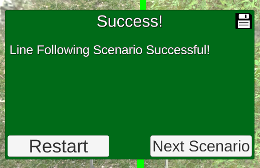

... however, this implementation leaves to desire in that the results are dependent on how the semi-line is specified.  The control is effected on the angle between the line origin and the local position -- so a different line origin for the same line would cause different control.

Instead, we should build a controller that depends only on something invariable about the abstraction -- in this case, the distance between the local position and the line.  The following implementation controls the distance between the point and the line via the angle that observes it, from the line, some arbitrary distance behind (controlled by the gain parameter):

```
    def straight_line_guidance(self, line_origin, line_course,
                               local_position):

        # Compute the distance between the local position and its projection on the line
        v_n = line_origin[0] - local_position[0]
        v_e = line_origin[1] - local_position[1]

        proj_angle = np.arctan2(v_e, v_n) - line_course
        line_distance = np.sqrt(v_n**2 + v_e**2) * np.sin(proj_angle)

        # Compute distance as angle from arbitrary point on line
        angle_error = np.arctan2(self.kp_course * line_distance, 1)

        # Control the error to zero
        course_cmd = line_course - angle_error

        return course_cmd
```

```
	# Gain parameters for the straight_line_guidance P controller
	self.kp_course = -0.003
```

### Scenario #10: Orbit Following

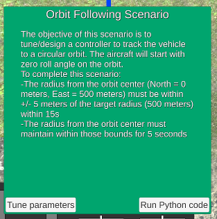

This scenario was somewhat non-intuitive -- I initially attempted to apply a controller directly to the angle values, with no success in making the system stable.

Instead, I took a page from the official solution and applied the P controller to the distance between the desired orbit value and the actual distance between plane and orbit center, converted to an angle value via arctangent.

This implementation is analogous to the official solution, but should be much simpler to read -- and requires its own tuning parameters, as it must fly with the previously tuned parameters for this solution (which do not match the official ones).

```
    def orbit_guidance(self, orbit_center, orbit_radius, local_position, yaw,
                       clockwise = True):

        # Determine the vector from orbit center to plane location
        center_to_location_n = local_position[0] - orbit_center[0]
        center_to_location_e = local_position[1] - orbit_center[1]

        # Get vector size and magnitude
        center_to_location_distance = np.sqrt(center_to_location_n**2 + center_to_location_e**2)
        center_to_location_orientation = np.arctan2(center_to_location_e, center_to_location_n)

        # Compute the error between actual orbit and desired orbit
        distance_error = center_to_location_distance - orbit_radius
        # Express error as angle / function of orbit
        angle_error = np.arctan(self.kp_orbit_guidance * distance_error / orbit_radius)

        # Compute tangent route orientation as feedforward -- rotate to get tangent from vector from orbit center
        if clockwise:
            tangent_angle = center_to_location_orientation - np.pi / 2
        else:
            tangent_angle = center_to_location_orientation + np.pi / 2

        # Combine feedforward and error and limit between -pi and pi
        course_cmd = angle_error + tangent_angle
        course_cmd = LateralAutoPilot.fmod(course_cmd)

        return course_cmd
```

```
    # Gain parameters for the orbit_guidance P controller
    self.kp_orbit_guidance = 2.5
```

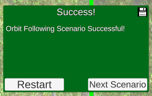

### Scenario #11: Lateral/Directional Challenge


This scenario requires a navigation from gate to gate, changing the behavior of the plane (from straight line following to orbit) within each segment.

It tests that counterclockwise rotation for orbit following is implemented correctly, as is following lines with a course other than 0 radians.

As a final surprise, the ending gate is *not* at (100, -680) as indicated on the documentation, but instead at (-400, -680).  If the plane is provided with the default (0, 0) controls past this non-existing gate, the plane will turn to the sides and cause plenty of confusion, causing me to check almost every single other controller implementation.


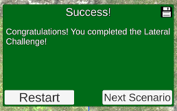

## Final Challenges

### Scenario #12: Full 3D Challenge

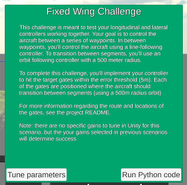

The implementation switches between two states, one for straight line following and another for orbit following.

The logic for computing the tangent points is as follows:
* Compute unit vectors between waypoints w1, w2 and w2, w3
* Determine the angle between w2, w1 and w3, w2 alpha
* Use that ratio of the orbit radius and the distance between w2 and the tangent points is tan(alpha / 2) to compute the distance between w2 and tangent points
* Determine the tangent points as the points on the legs at the calculated distance from w2

The center of the orbit can be computed from the w2, center, tangent point triangle, at the direction from w2 that is the average between legs

The orientation of the orbit (clockwise or not) can be determined based on the sign of cross product between the legs.

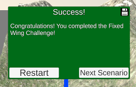

### Scenario #13: Flying Car Challenge