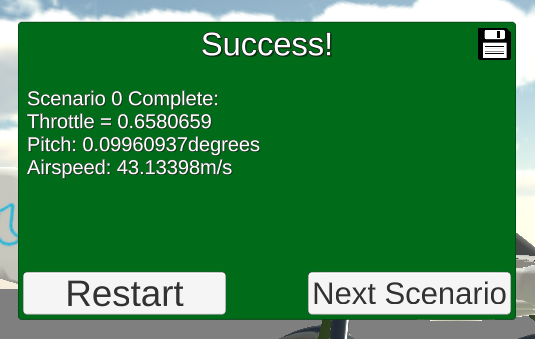
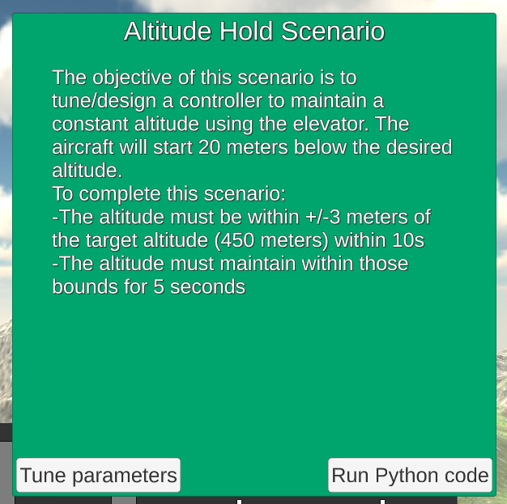
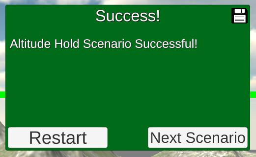

## Optional Project: Fixed-Wing Control

---

[Staff-provided equations linked here](https://www.overleaf.com/read/cvqmtzyhqjnj)

---

#### Longitudinal Scenarios

##### Scenario 1: Trim (Unity Only)

This scenario requires no coding or gains to tune -- just calibrating the values manually on the flight simulator.


The fixed throttle at **65.8%** eventually leads to success:




##### Scenario 2: Altitude Hold

This scenario requires implementing the pitch hold and altitude hold controllers.  They are implemented as PD and PI controllers, respectively.



Tuning the process produces the following gains:

```
    # Gain parameters for pitch_loop PD controller
    self.kp_pitch = 4.0
    self.kp_q = 0.5

    # Gain parameters for altitude_loop PI controller
    self.kp_alt = 0.03
    self.ki_alt = 0.02
```

Of note, the official solution (and the tuning facility through Unity!) has a couple of implementation choices that cause a discrepancy between the tuning obtained in Unity and the initial implementation I had:
- A minimum pitch command is set to -10 degrees, different from the maximum pitch command of 30 degrees.
- A particular implementation of integrator anti-windup is used on the PI controller for attitude_loop:

```
    # Integrator anti-windup
    if(gain_i_alt != 0):
        self.alt_int = self.alt_int + dt/gain_i_alt*(pitch_cmd-pitch_cmd_unsat)
``` 
 
This implementation changes the integrated error to have been updated by a value equivalent to the error that would have been added if the commanded pitch had been its saturated value, rather than the unbounded one.

I implemented equivalent logic, for ease of tuning in future scenarios.



##### Scenario 3: Airspeed Hold

##### Scenario 4: Steady Climb

##### Scenario 5: Longitudinal Challenge

---

#### Lateral / Directional Scenarios


##### Scenario 6: Stabilized Roll Angle

##### Scenario 7: Coordinated Turn

##### Scenario 8: Constant Course/Yaw Hold

##### Scenario 9: Straight Line Following

##### Scenario 10: Orbit Following

##### Scenario 11: Lateral/Directional Challenge

#### Final Challenges

##### Scenario 12: Full 3D Challenge

##### Scenario 13: Flying Car Challenge